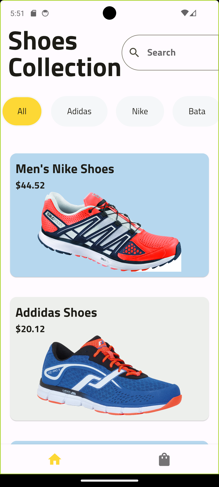
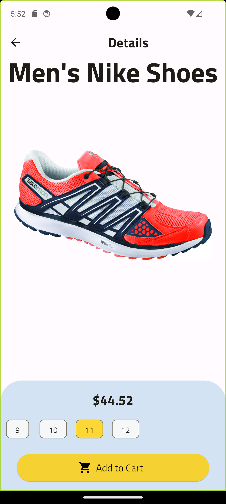
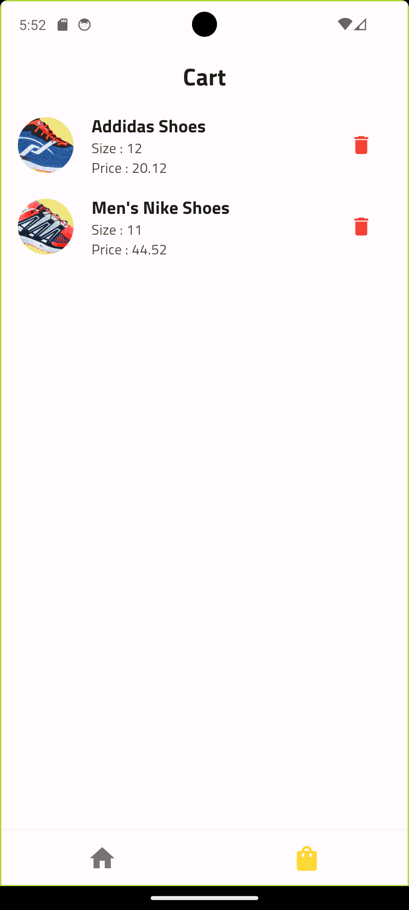

 

  <h3 align="center">Basic Shop App using Flutter</h3>

  

    <a href="https://github.com/mnazal/Basic Shop App using Flutter"><strong>Explore the docs »</strong></a>
     
     
    <a href="https://github.com/mnazal/Basic Shop App using Flutter">View Demo</a>
    .
  

## About The Project

A Basic flutter Shop App with responsive UI which lists product from a list, have options to add to cart and remove from cart which works on Android, Web and Ios.

## UI in Android

## Web

